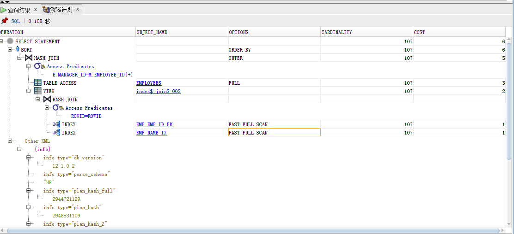
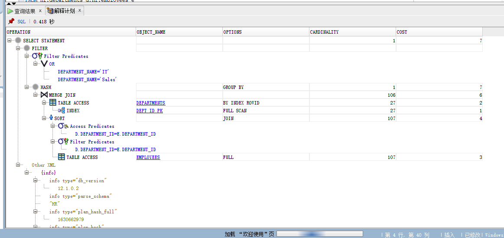

# 实验一
## 分析oracle12c教材上的查询语句
- 语句一：
```
SELECT e.EMPLOYEE_ID,e.FIRST_NAME,e.MANAGER_ID,
(SELECT M.FIRST_NAME FROM employees m 
WHERE m.EMPLOYEE_ID=e.MANAGER_ID)
AS MANAGER_NAME FROM hr.employees e ORDER BY e.EMPLOYEE_ID;
``` 

    
    
- 语句二：

```
SELECT e.EMPLOYEE_ID,e.FIRST_NAME,e.MANAGER_ID,m.FIRSTNAME
AS MANAGER_NAME FROM employees e,employees m WHERE
e.MANAGER_ID=m.EMPLOYEE_ID(+)ORDER BY e.EMPLOYEEE_ID;
```

    
## 给出的实验语句分析

- 语句一：

```
SELECT d.department_name，count(e.job_id)as "部门总人数"，
   avg(e.salary)as "平均工资"
   from hr.departments d，hr.employees e
   where d.department_id = e.department_id
   and d.department_name in ('IT'，'Sales')
   GROUP BY department_name;
```


分析：该语句的含义是查出名字为'IT','Sales'的部门的名字，以及每个部门的部门总人数和平均工资
并以部门名字分组。


- 语句二：
```
SELECT d.department_name，count(e.job_id)as "部门总人数"，
avg(e.salary)as "平均工资"
FROM hr.departments d，hr.employees e
WHERE d.department_id = e.department_id
GROUP BY department_name
HAVING d.department_name in ('IT'，'Sales');
```

## 自定义语句

- 语句一：


- 语句二：