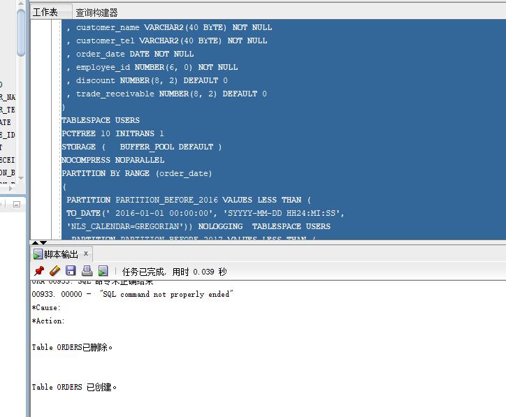
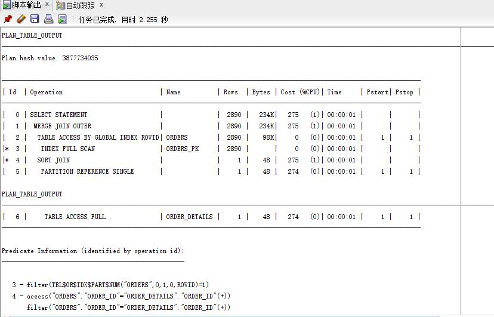
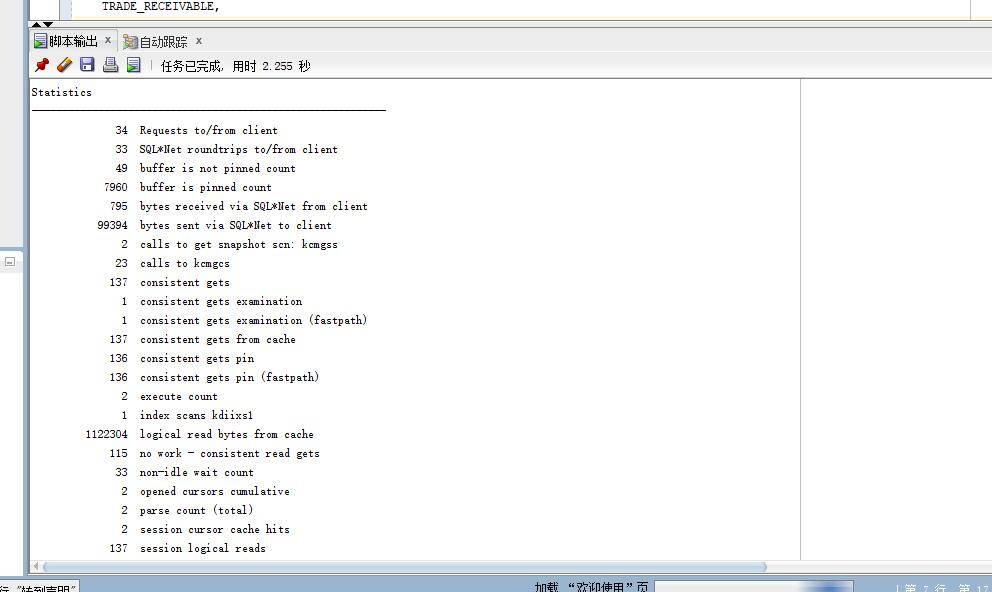
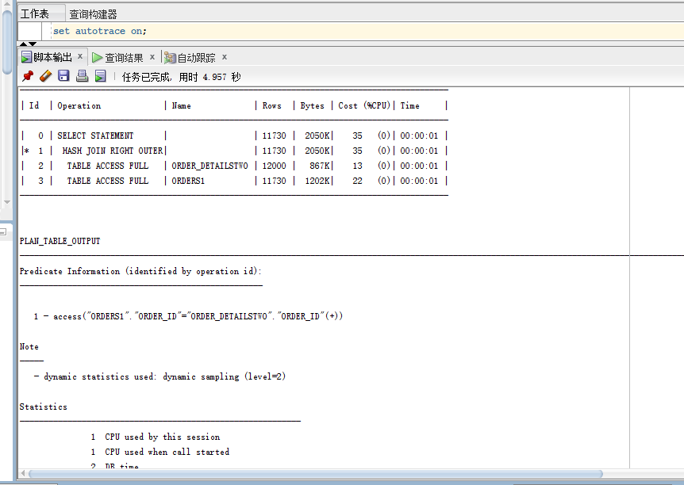

# 实验三

##第一步：以管理员身份分配表空间给我自己的用户（new_user_liujun）
ALTER USER new_user_liujun QUOTA 50M ON users;  

ALTER USER new_user_liujun QUOTA 50M ON users02;  

ALTER USER new_user_liujun QUOTA 50M ON users03;  


##第二步：新建orders表并以年份为范围分区到users，users02，users03
```$xslt
CREATE TABLE orders 
(
 order_id NUMBER(10, 0) NOT NULL 
 , customer_name VARCHAR2(40 BYTE) NOT NULL 
 , customer_tel VARCHAR2(40 BYTE) NOT NULL 
 , order_date DATE NOT NULL 
 , employee_id NUMBER(6, 0) NOT NULL 
 , discount NUMBER(8, 2) DEFAULT 0 
 , trade_receivable NUMBER(8, 2) DEFAULT 0 
) 
TABLESPACE USERS 
PCTFREE 10 INITRANS 1 
STORAGE (   BUFFER_POOL DEFAULT ) 
NOCOMPRESS NOPARALLEL 
PARTITION BY RANGE (order_date) 
(
 PARTITION PARTITION_BEFORE_2016 VALUES LESS THAN (
 TO_DATE(' 2016-01-01 00:00:00', 'SYYYY-MM-DD HH24:MI:SS', 
 'NLS_CALENDAR=GREGORIAN')) NOLOGGING  TABLESPACE USERS  
 
, PARTITION PARTITION_BEFORE_2017 VALUES LESS THAN (
TO_DATE(' 2017-01-01 00:00:00', 'SYYYY-MM-DD HH24:MI:SS', 
'NLS_CALENDAR=GREGORIAN')) NOLOGGING TABLESPACE USERS02

, PARTITION PARTITION_BEFORE_2018 VALUES LESS THAN (
TO_DATE(' 2018-01-01 00:00:00', 'SYYYY-MM-DD HH24:MI:SS', 
'NLS_CALENDAR=GREGORIAN')) 
NOLOGGING TABLESPACE USERS03
);
```

##第三步：创建order_details为orders的从表并根据orders的分区进行分区
```$xslt
CREATE TABLE order_details
(
id NUMBER(10,0)NOT NULL,
order_id NUMBER(10,0)NOT NULL,
product_id VARCHAR2(40 BYTE)NOT NULL,
product_num NUMBER(8,2) NOT NULL,
product_price NUMBER(8,2) NOT NULL,
CONSTRAINT order_details_fk1 FOREIGN KEY (order_id)
REFERENCES orders ( order_id )
ENABLE
)
TABLESPACE USERS
PCTFREE 10 
INITRANS 1
STORAGE( BUFFER_POOL DEFAULT )
NOCOMPRESS NOPARALLEL
PARTITION BY REFERENCE (order_details_fk1);
```

##第四步插入数据到orders表中
```$xslt
begin
for i in 1..4000
loop   
insert into orders(ORDER_ID ,customer_name, customer_tel, order_date, employee_id, trade_receivable, discount) VALUES(i,'liujun', '158...', to_date ( '2017-10-21 10:31:32' , 'YYYY-MM-DD HH24:MI:SS' ), 007, 16, 7);
end loop;
    commit;
end;
/
```
```$xslt
begin
for i in 4001..8000
loop   
insert into orders(ORDER_ID ,customer_name, customer_tel, order_date, employee_id, trade_receivable, discount) VALUES(i,'liujun', '158...', to_date ( '2017-10-21 10:31:32' , 'YYYY-MM-DD HH24:MI:SS' ), 007, 16, 7);
end loop;
    commit;
end;
/
```

```$xslt
begin
for i in 8001..12000
loop   
insert into orders(ORDER_ID ,customer_name, customer_tel, order_date, employee_id, trade_receivable, discount) VALUES(i,'liujun', '158...', to_date ( '2017-10-21 10:31:32' , 'YYYY-MM-DD HH24:MI:SS' ), 007, 16, 7);
end loop;
    commit;
end;
/
```


##第四步插入数据到orders_detail表中
```$xslt
begin
for i in 8001..12000
loop   
insert into order_details(id,ORDER_ID, PRODUCT_ID, PRODUCT_NUM, PRODUCT_PRICE) VALUES(11,i, 12, 13, 14.15);
end loop;
    commit;
end;
/
```


##第五步联合查询：
```$xslt
SELECT
    orders.order_id,
    orders.order_date,
    order_details.order_id,
    TRADE_RECEIVABLE,
    PRODUCT_ID,
    PRODUCT_PRICE
FROM orders partition (PARTITION_BEFORE_2016) LEFT JOIN order_details partition (PARTITION_BEFORE_2016)
ON (orders.order_id = order_details.order_id);
    
```
  

  



##不分区对比：



##对比：  
- 同样多的数据分区后的查询：  
cpu消耗275 ，consistent gets=137
- 不分区：  
cpu消耗35 ，consistent gets=89  
虽然分区消耗cpu多，访问数据块次数多。但是在用时上小于不分区的。分区只需要搜索特定分区，而非整张表，提高了查询速度。